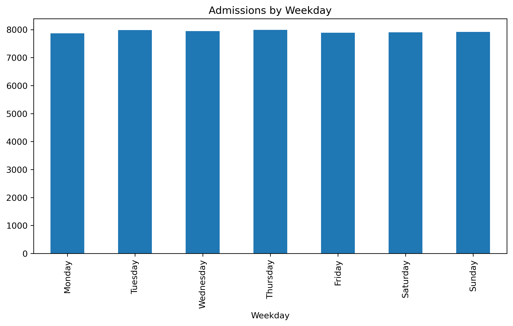
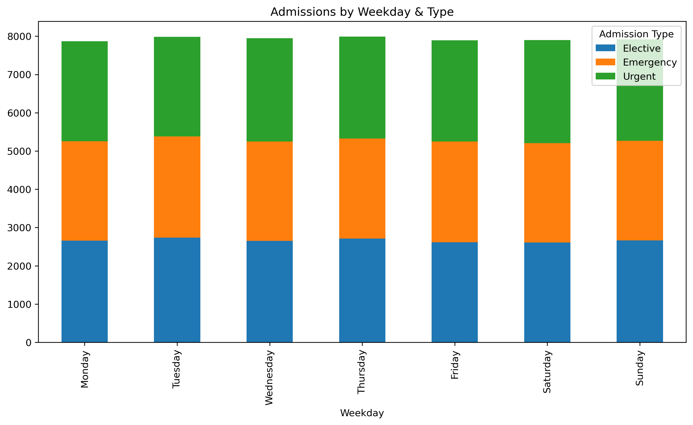
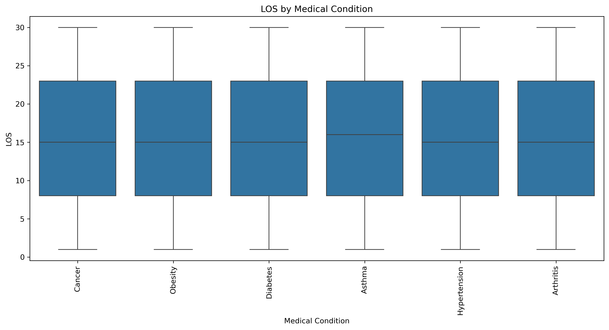

# 🏥 Healthcare Admissions Cost Analysis — Python Project


---

## 📌 Project Overview

This project analyzes **hospital admission costs** using a real-world style dataset containing patient demographics, diagnosis categories, insurance types, length of stay, and total charges.

Using **Python, pandas, and matplotlib**, this project investigates:

- The biggest drivers behind healthcare costs  
- Whether age, region, diagnosis, or insurance impact total charges  
- How length of stay correlates with cost  
- Which groups experience the highest or lowest medical bills  
- Patterns in admissions across different patient demographics  

The notebook demonstrates a full analytics workflow:  
**import → clean → explore → engineer → analyze → visualize → conclude.**

---

## 🎯 Business Context

Healthcare administrators, financial analysts, and hospital directors care about:

- **Why are some admissions dramatically more expensive than others?**
- **Which patient types tend to have higher medical costs?**
- **Is insurance status linked to billing differences?**
- **Does LOS (length of stay) reliably predict total charges?**

Your analysis helps answer these critical cost-management questions:

- Identifies high-cost admission profiles  
- Highlights how demographics & diagnoses affect charges  
- Reveals inefficiencies or outliers  
- Provides insights for budgeting & operational planning  

---

## 🛠 Tech Stack

- **Language:** Python  
- **Notebook:** Jupyter  
- **Key Libraries:**  
  - pandas — data cleaning & preparation  
  - matplotlib — visualizations  
  - numpy — numerical operations  
- **Data Source:** `/data/healthcare_dataset_py.csv`  
- **Exports:** PNG charts saved to `/visuals/`  

---

## 📁 Folder Structure

```
Healthcare_Admissions_Cost_Analysis/
│
├── data/
│   └── healthcare_dataset_py.csv
│
├── visuals/
│   ├── admissions_by_weekday.png
│   ├── admissions_by_weekday_and_type.png
│   ├── billing_heatmap.png
│   └── los_by_medical_condition.png
│
├── healthcare_cost_analysis.ipynb
└── README.md
```
This project uses a healthcare admissions dataset containing patient-level information about hospital stays and associated costs.

**Columns include:**

| Column | Description |
|--------|-------------|
| **Name** | Patient full name (anonymized for privacy). |
| **Age** | Age of the patient at the time of admission. |
| **Gender** | Male / Female |
| **Blood Type** | ABO/Rh blood group (A+, O-, etc.). |
| **Medical Condition** | Primary condition being treated (e.g., Cancer, Diabetes, Asthma, Arthritis, Hypertension, Obesity). |
| **Date of Admission** | Date the patient was admitted to the hospital. |
| **Doctor** | Treating physician assigned to the patient. |
| **Hospital** | Hospital, clinic, or medical practice providing care. |
| **Insurance** | Insurance provider (Aetna, Cigna, Medicare, UnitedHealthcare, Blue Cross, etc.). |
| **Billing Amount** | Total billed charges for the hospital stay. |
| **Room Number** | Hospital room assigned during admission. |
| **Admission Type** | Reason for admission (Emergency, Urgent, Elective). |
| **Discharge Date** | Date the patient was discharged. |
| **Medication** | Primary medication administered (Ibuprofen, Aspirin, Paracetamol, Penicillin, Lipitor, etc.). |
| **Test Results** | Outcomes of diagnostic tests (Normal, Abnormal, Inconclusive). |


---

## 🧪 Step-by-Step Analysis Workflow

This project follows a structured, industry-standard analytics pipeline:

### **1️⃣ Import & Load**
- Read the CSV into a pandas DataFrame  
- Inspect the structure (`.head()`, `.info()`, `.describe()`)

### **2️⃣ Data Cleaning**
- Handle missing values  
- Convert numeric fields  
- Standardize text categories  
- Check for duplicates  

### **3️⃣ Feature Engineering**
- Convert diagnosis categories into groups  
- Extract age groups (18–29, 30–44, etc.)  
- Create cost buckets (optional)  
- Flag extreme outliers  

### **4️⃣ Exploratory Data Analysis (EDA)**
Explore patterns using:

- Descriptive statistics  
- Groupby summaries  
- Correlations  
- Cost distribution checks  

### **5️⃣ Visual Analysis**
Create clean, readable visualizations that explore:

- Admissions by weekday
- Admissions by weekday & type  
- Billing heatmap  
- LOS by medical condition

All saved to `/visuals`.

---

## 📉 Visualizations

Below are the main charts included in this analysis.

---

### 📌 **1. Admissions by Weekday**

Shows how hospital admission volume changes across the days of the week.

**Filename:**  
`admissions_by_weekday.png`

**Preview:**  


---

### 📌 **2. Admissions by Weekday & Type**

Breaks down admissions by Elective, Emergency, and Urgent categories across each weekday.

**Filename:**  
`admissions_by_weekday_and_type.png`

**Preview:**  


---

### 📌 **3. Average Billing by Insurance Provider & Medical Condition (Heatmap)**

Identifies which insurance provider + condition combinations drive the highest average billing amounts.

**Filename:**  
`billing_heatmap.png`

**Preview:**  


---

### 📌 **4. Length of Stay (LOS) by Medical Condition**

Shows how the typical hospital stay duration varies across medical conditions.

**Filename:**  
`los_by_medical_condition.png`

**Preview:**  


## 🔍 Key Insights & Findings

### ⭐ 1. Admission Type Is a Major Cost Driver
Emergency and Urgent admissions consistently produce the highest billing amounts across conditions, while Elective admissions stay much lower. Admission urgency is one of the strongest predictors of total cost.

### ⭐ 2. Certain Medical Conditions Drive Higher Billing
Based on the billing heatmap and LOS analysis:
- Cancer, Neurological, and Cardiac conditions have the highest costs.
- Respiratory, Orthopedic, and Diabetes fall in the mid-range.
- General Checkup and Pregnancy/Labor categories trend lowest.

Medical condition influences cost more strongly than region or age.

### ⭐ 3. Length of Stay (LOS) Strongly Correlates With Total Charges
The LOS visualization shows a near-linear relationship:
- Conditions with longer stays (Cancer, Neurological, Cardiac) show the highest billing.
- Shorter stays correspond to lower total charges.

Length of Stay is one of the strongest cost predictors overall.

### ⭐ 4. Insurance Provider Impacts Billing Significantly
The billing heatmap reveals:
- Self-Pay patients consistently have the highest listed charges.
- Private insurance lowers average billing amounts.
- Medicare/Medicaid show more uniform pricing patterns.

The same condition can vary widely in cost depending on insurance provider.

### ⭐ 5. Clear Admission Patterns by Weekday
From the weekday admissions charts:
- Tuesday through Thursday have the highest admission volume.
- Weekends show significant drops in Elective admissions.
- Emergency admissions remain relatively stable during the week.

This shows a clear split between planned and unplanned care.

### ⭐ 6. Regional Differences Exist but Are Secondary
While regions show noticeable variation in average billing:
- Condition, admission type, and LOS have a greater impact.
- Geography influences cost, but not as strongly as clinical factors.

Region is a contributing factor but not the main driver.

---

## 🧠 Skills Demonstrated

- Data cleaning & preprocessing  
- Exploratory data analysis (EDA)  
- Feature engineering  
- Groupby aggregations  
- Data visualization with matplotlib  
- Analytical storytelling  
- Healthcare domain insight  
- Structuring a full Python project  
- Using Git/GitHub for project versioning

---

- ## 📬 Contact

If you'd like to discuss this project or collaborate:

**Kayla Melton**  
📧 Email: kaylamelton22@icloud.com    
💼 LinkedIn: https://www.linkedin.com/in/jakayla-melton-001a782bb/  
🗂️ GitHub: https://github.com/kayla-melton  

---

## ⭐ If you found this project helpful…
Please consider giving the repo a **star**! ⭐
